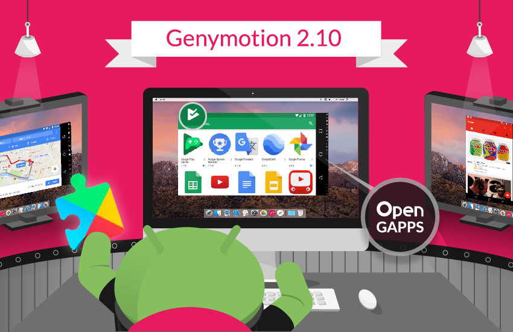

<div align="center">
    <a href="#">
        
    </a>
    <h1><a href="#">Genymotion Packages</a> </h1>


[](https://svgshare.com/i/Zhy.svg)
[](LICENSE)


[**Read The Docs**](https://blog.rocketseat.com.br/como-fazer-um-bom-readme) |
[Author](https://github.com/howstrangeoficial) |
[License](LICENSE) |
[Issues](https://github.com/howstrangeoficial/genymotion/issues) |
[Contributing](contributing.md)

</div>


Table of Contents
=================
   * [About the Project](#About)
   * [Install Project](#Install)
   * [Preview Project Deskop](#preview)
      * [Local files](#Local-Files)
      * [Project Usage](#Usage)
      * [Project Support](#Support)
   * [Technologies Usage](#Technologies)

<br>

# About
<p align="center"> Packs de arm translate para o Emulador de android Genymotion.</p>

<br>

# Install
```bash
#git clone repository

$ git clone https://github.com/howstrangeoficial/genymotion.git
```

<br>

# Usage
1. download Genymotion-ARM-Translation-for[v]
2. Will download the toolkit drag and drop into the Genymotion directly,
3. If failure
```
  1. adb shell
  2. cd /sdcard/Download/
  3. sh /system/bin/flash-archive.sh /sdcard/Download/Genymotion-ARM-Translation.zip
  4. adb reboot
```
4. Resetting the Emulator

<br>

## Install Adb

```bash
  brew cask install android-platform-tools
```

<br>

## Android version mapping

* [4.3](/package/Genymotion-ARM-Translation_for_4.3.zip)
* [4.4](/package/Genymotion-ARM-Translation_for_4.4.zip)
* [5.1](/package/Genymotion-ARM-Translation_for_5.1.zip)
* [6.0](/package/Genymotion-ARM-Translation_for_6.0.zip)
* [7.X](/package/Genymotion-ARM-Translation_for_7.X.zip)
* [8.0](/package/Genymotion-ARM-Translation_for_8.0.zip)


<br>

# Support
Tell people where they can go to for help. It can be any combination of an issue tracker, a chat room, an email address, etc.
Email support alansilva@asasolucoes.com

<br>

<h4 align="center"> 
	🚧  Project status 🚀 Done...  🚧
</h4>

<br>

# Preview

Viewing a preview image to describe the project itself.
